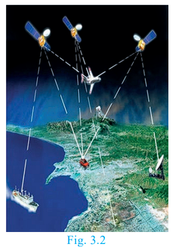
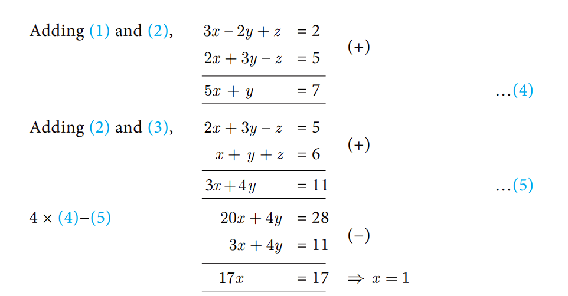
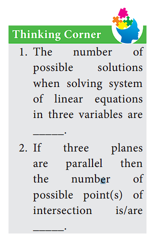


# Simultaneous Linear Equations in Two Variables

Let us recall solving a pair of linear equations in two variables

**Definition**
**Linear Equation in two variables**
Any first degree equation containing two variables x and y is called a linear equation in two variables. The general form of linear equation in two variables x and y is ax+by+c = 0, where atleast one of a, b is non-zero and a, b, c are real numbers. 
Note that linear equations are first degree equations in the given variables

 **NOTE** 
1. xy – 7 = 3 is not a linear equation in two variables since the term xy is of degree 2.
2. A linear equation in two variables represent a straight line in xy plane.

**Example 3.1** The father’s age is six times his son’s age. Six years hence the age of father 
will be four times his son’s age. Find the present ages (in years) of the son and father. 
**Solution** Let the present age of father be x years and 
the present age of son be y years

Given, x = 6y        …(1)
x + 6 = 4(y + 6)      … (2)  
Substituting (1) in (2), 6y + 6 = 4 (y + 6)
6y + 6 = 4y + 24 => y = 9
Therefore, son’s age = 9 years and father’s age = 54 years.

**Example 3.2**	 Solve 2x − 3y = 6 , x + y = 1
**Solution**	2x − 3y = 6  … (1)  


\begin{aligned}
x + y = 1\\	
(1)×1 ⇒ 2x-3y = 6 \\
(2)×2 ⇒ 2x+2y = 2  \\
\hline
&-5y = 4 =>  y =  x =\frac{-4}{5} 
\end{aligned}


 

Substituting y =\\(\frac{-4}{5}\\) in (2), \\( x −\frac{4}{5}=1\\) we get,\\( x=\frac{9}{5}\\)
Therefore, x=\\(\frac{9}{5}\\), \\(y =\frac{-4}{5}\\). 

## Simultaneous Linear Equations in Three Variables

 Right from the primitive needs of calculating amount spent for various items in a super market, finding ages of people under specific conditions, finding path of an object when it is thrown upwards at an angle, Algebra plays a vital role in our daily life.

Any point in the space can be determined uniquely by knowing its   latitude,   longitude   and   altitude.   Hence to locate the position of an object at a particular place situated on the Earth, three satellites are positioned to arrive   three   equations.   Among   these   three   equations, we get two linear equations and one quadratic (second degree) equation. Hence we can solve for the variables latitude, longitude and altitude to uniquely fix the position of any object at a given point of time. This is the basis of Global Positioning System (GPS). Hence the concept of linear equations in three variables is used in GPS systems.

### System of Linear Equations in Three Variables
In earlier classes, we have learnt different methods of solving Simultaneous Linear Equations in two variables. Here we shall learn to solve the system of linear equations in three variables namely, x, y and z. The general form of a linear equation in three variablesx, y and z is ax + + by cz + =d 0 where a, b, c, d are real numbers, and atleast one of a, b, c is non-zero.

**NOTE**

**General Form:** A system of linear equations in three variables x, y, z has the general form
\\(a_{1}x + b_{1}y + c_{1}z + d_{1}  = 0\\)
\\(a_{2}x + b_{2}y + c_{2}z + d_{2} = 0\\)
\\(a_{3}x + b_{3}y + c_{3}z + d_{3} = 0\\)
Each equation in the system represents a plane in three dimensional space and solution of the system of equations is precisely the point of intersection of the three planes defined by the three linear equations of the system. The system may have only one solution, infinitely many solutions or no solution depending on how the planes intersect one another

The figures presented below illustrate each of these possibilities

**Procedure for solving system of linear equations in three variables**

**Step 1:** By taking any two equations from the given three, first multiply by some suitable non-zero constant to make the co-efficient of one variable (either x or y or z) numerically equal.
**Step 2:** Eliminate one of the variables whose co-efficients are numerically equal from the equations.
**Step 3:** Eliminate the same variable from another pair.
**Step 4:** Now we have two equations in two variables.
**Step 5:** Solve them using any method studied in earlier classes.
**Step 6:** The remaining variable is then found by substituting in any one of the given equations.

**NOTE** 
1. If you obtain a false equation such as 0=1, in any of the steps then the system has no
solution.
2. If you do not obtain a false solution, but obtain an identity, such as 0=0 then the system
has infinitely many solutions.

**Example 3.3**
 Solve the following system of linear equations in three variables
3x – 2y + z =2 , 2x + 3y – z = 5 , x + y + z = 6 .
**Solution** 3x − 2y + z = 2   ...(1)	
2x + 3y – z = 5 ...(2)	 
x + y + z = 6 ...(3)

Substituting x = 1 in (4), 5 + y = 7=> y = 2
Substituting x = 1 , y = 2 in (3), 1 + 2 + z = 6 we get, z = 3
Therefore,  x = 1, y = 2 ,  z = 3

**Example 3.4**
     In an interschool atheletic meet, with total of 24 individual prices, securing a total of 56 points, a first place secures 5 points, a second place secures 3 points, and a third place secures 1 point. Having as many third place finishers as first and second place finishers, find how many athletes finished in each place.

**Solution** Let the number of I, II and III place finishers be x , y and z respectively.
Total number of events = 24; Total number of points = 56. Hence, the linear equations in three variables are
 
x + y + z = 24 …(1)	5x + 3y + z = 56 …(2)	x + y = z …(3)
 
Substituting (3) in (1) we get, z + z = 24 => z = 12
 (3) will be, x + y = 12

     (2)   =>	5x + 3y=44
                                (-)
     3x(3) =>       3x + 3y=36
    ---------------------------
 	                2x     = 8	we get, x = 4 
        
Substituting x = 4 , z = 12 in (3) we get, y = 12 − 4 = 8 
Therefore, Number of first place finishers is 4
Number of second place finishers is 8 
Number of third place finishers is 12.

**Example 3.5** Solve x + 2y – z = 5 ; x − y + z = −2 ; −5x − 4y + z = −11
**Solution**	x + 2y – z =5 ...(1) 	x – y + z =–2 ...(2)   –5x –4y + z = –11 ...(3)
    

     Adding(1)and(2) we get, x + 2y – z = 5
                                           (+)
                             x – y + z = –2 
                        -----------------------
                            2x + y	   = 3               …(4) 
                        -----------------------
    Subtracting (2) and (3),  x −  y + z = –2
                                               (−)
                            −5x − 4y + z = –11 
                        -----------------------
                             6x + 3y      =  9
                        -----------------------
    Dividing by 3            2x+y = 3                     …(5)
    Subtracting (4) and (5), 2x+y = 3
                             2x+y = 3
                        ----------------------
                                0 = 0
                        ----------------------
Here we arrive at an identity 0=0.
Hence the system has an infinite number of solutions.

**Example 3.6** 	Solve 3x + y – 3z = 1 ; –2x – y + 2z = 1 ; –x – y + z = 2 .
**Solution**	3x + y − 3z = 1	… (1)	–2x – y + 2z = 1 …(2)	−x − y + z = 2 …(3)

    Adding (1) and (2),      3x + y − 3z = 1  
                                            (+)
                            −2x − y + 2z = 1	
                            --------------------
                              x –      z  = 2	         ...(4)
                            --------------------
    Adding (1) and (3),      3x + y − 3z = 1
                                            (+)
                             −x − y +  z = 2
                            --------------------
                             2x   -   2z = 3
                             --------------------            ...(5)
                             2x   -   2z = 3
                                            (-)    
    Now,(5)−2×(4) we get,    2x   -   2z = 4
                             --------------------
                                       0 = -1
                             --------------------  
Here we arrive at a contradiction as 0 ≠ –1.
This means that the system is inconsistent and has no solution.

**Example 3.7** Solve \\(\frac{x}{2}-1=\frac{y}{6}+1=\frac{z}{7}+2;\frac{y}{3}+\frac{z}{2}\\)=13

**Solution** Considering, \\(\frac{x}{2}-1=\frac{y}{6}+1\\)

\\( \frac{x}{2}-\frac{y}{6}=1+1\\) => \\(\frac{6x-2y}{12}=2\\) we get, 3x-y=12  ...(1)

Considering, \\(\frac{x}{2}-1=\frac{z}{7}+2\\)
\\(\frac{x}{2}-\frac{z}{7}=1+2\\) => \\(\frac{7x-2x}{14}=3\\) we get, 7x − 2z = 42	… (2)

Also, from \\(\frac{y}{3}+\frac{z}{2}\\)=13 => \\(\frac{2y+3z}{6}\\)=13 we get, 2y + 3z = 78 … (3)

Eliminating z from (2) and (3)

Substituting x= 10 in (1), 30 12 − =y we get, y = 18
Substituting x = 10 in (2), 70 − = 2 4 z 2 then, z = 14
∴ x = 10 , y = 18 , z = 14 .

**Example 3.8** Solve \\(\frac{1}{2X}+\frac{1}{4Y}-\frac{1}{3Z}=\frac{1}{4};\\)\\(\frac{1}{x}=\frac{1}{3Y};\\)\\(\frac{1}{x}-\frac{1}{5Y}+\frac{4}{z}=2\frac{2}{15}\\)

**Solution** Let \\(\frac{1}{x}=p, \frac{1}{Y}=q, \frac{1}{z}=r\\)

The given equations are written as
\\(\frac{p}{2}+\frac{q}{4}-\frac{r}{3}=\frac{1}{4}\\)
\\(p=\frac{q}{3}\\)
\\(p-\frac{q}{5}+4r=2\frac{2}{15}=\frac{32}{15}\\)

     By simplifying we get, 
          6p + 3q − 4r= 3	                      …(1)
          3p	  = q                         …(2)
          15p − 3q + 60r= 32	              …(3)
     Substituting (2) in (1) and (3) we get,
          15p - 4r= 3                             …(4)
          6p + 60r= 32 reduces to 3p + 30r= 16    …(5)
     Solving (4) and (5),
               15p -  4r =3  
                            (-)
               15p + 150r=80
               ---------------
                    -154r=-77     
               ---------------
 we get, r=\\(\frac{1}{2}\\)
 Substituting r=\\(\frac{1}{2}\\) in (4) we get, 15p - 2 = 3 => p=\\(\frac{1}{3}\\)  
 From (2), q = 3p we get q = 1
 Therefore, \\(x = \frac{1}{p}=3, y=\frac{1}{q}=1, z=\frac{1}{r}=2.\\) i.e., x=3,y=1,z=2

 **Example 3.9**    The sum of thrice the first number, second number and twice the third number is 5. If thrice the second number is subtracted from the sum of first number and thrice the third we get 2. If the third number is subtracted from the sum of twice the first, thrice the second, we get 1. Find the numbers.
**Solution** Let the three numbers be x, y, z
From the given data we get the following equations,

3x + y + 2z = 5 …(1)	
x + 3z – 3y = 2 …(2)	
2x + 3y – z = 1 …(3) 

          (1) × 1 =>	3x +  y + 2z = 5
                                             (−)
          (2) × 3 =>	3x – 9y + 9z = 6	
                         _________________
                             10y – 7z = –1	          …(4)
                         _________________
          (1) × 2 =>	6x + 2y + 4z= 10
                                             (−)
          (3) ×3 => 	6x + 9y − 3z= 3	
                         _________________
                               − 7y + 7z  = 7	          …(5)
                         _________________
     Adding (4) and (5),     10y – 7z  = –1
                             −7y + 7z  = 7
                         _________________
                              3y	   = 6	=> y = 2
 
Substituting y = 2 in (5),−14 + 7z = 7 => z = 3
Substituting y = 2 and z = 3 in (1),
3x + 2 + 6	= 5 we get x = −1
Therefore, x  = –1, y = 2, z = 3.

**Progress Check**
1.	For a system of linear equations in three variables the minimum number of equations required to get unique solution is _______.
2.	A system with _________ will reduce to identity.
3.	A system with ________ will provide absurd equation.

1. Solve the following system of linear equations in three variables. 

     (i)  \\(x + y + z = 5 ; 2x − y + z = 9 ; x − 2y + 3z = 16\\)

     (ii)  \\(\frac{1}{x}-\frac{2}{y}+4;\\)\\(\frac{1}{y}-\frac{1}{z}+1=0;\\)\\(\frac{2}{z}+\frac{3}{x}=14\\)
     
     (iii) \\(x+20=\frac{3y}{2}+10=2z+5=110-(y+z)\\)

2. Discuss the nature of solutions of the following system of equations.

     (i) \\(x + 2y − z = 6 ; −3x − 2y + 5z = −12 ; x − 2z = 3\\)
     
     (ii) \\(2y + z = 3(−x + 1) ; −x + 3y − z = −4 ; 3x + 2y + z=-\frac{1}{2}\\)

     (iii) \\(\frac{y+z}{4}=\frac{z+x}{3}=\frac{x+y}{2};\\)\\(x+y+z=27\\)
     

3. Vani, her father and her grand father have an average age of 53. One-half of her grand father’s age plus one-third of her father’s age plus one fourth of Vani’s age is 65. Four years ago if Vani’s grandfather was four times as old as Vani then how old are they all now ?

4. The sum of the digits of a three-digit number is 11. If the digits are reversed, the new number is 46 more than five times the former number. If the hundreds digit plus twice the tens digit is equal to the units digit, then find the original three digit number ?

5. There are 12 pieces of five, ten and twenty rupee currencies whose total value is ₹105. When first 2 sorts are interchanged in their numbers its value will be increased by ₹20. Find the number of currencies in each sort.

     

