# Geometry
## Circles and Tangents

In our day-to-day real life situations, we have seen two lines intersect at a point or do not intersect in a plane. For example, two parallel lines in a railway track, do not intersect. Whereas, grills in a window intersect.

Similarly what happens when a curve and a line is given in a plane? The curve may be parabola, circle or any general curve.

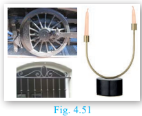

Similarly, what happens when we consider intersection of a line and a circle?

We may get three situations as given in the following diagram

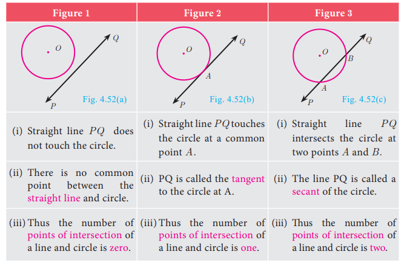

**Definition**

If a line touches the given circle at only one point, then it is called tangent to the circle.

**Real life examples of tangents to circles**

(i) When a cycle moves along a road, then the road becomes the tangent at each point when the wheels rolls on it.

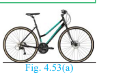

(ii) When a stone is tied at one end of a string and is rotated from the other end, then the stone will describe a circle. If we suddenly stop the motion, the stone will go in a direction tangential to the circular motion.

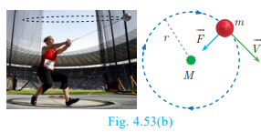

**Some results on circles and tangents**

1. A tangent at any point on a circle and the radius through the point are perpendicular to each other.

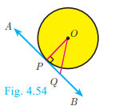

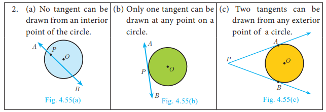

3. The lengths of the two tangents drawn from an exterior point to a circle are equal,

Proof : By 1. $O A \perp P A, O B \perp P B$. Also $O A=O B=$ radius, $O P$ is common side. $\angle A O P=\angle B O P$

Therefore, by SAS Rule $\triangle O A P \cong \triangle O B P$. Hence $P A=P B$

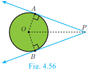

4. If two circles touch externally the distance between their centers is equal to the sum of their radii, that is $O P=r_{1}+r_{2}$

**Proof:** Let two circles with centers at $O$ and $P$ touch other at $Q$.

Let $O Q=r_{1}$ and $P Q=r_{2}$ and let $r_{1}>r_{2}$.

The distance between their centers $O P=d$. It is clear from the Fig. 4.57 that when the circles touch externally $O P=d=O Q+P Q=r_{1}+r_{2}$.

5. If two circles touch internally, the distance between their centers is equal to the difference of their radii, that is $O P=r_{1}-r_{2}$.

**Proof** : Let two circles with centers at $O$ and $P$ touch each other at $Q$. Let $O Q=r_{1}$ and $P Q=r_{2}$ and let $r_{1}>r_{2}$.

The distance between their centers $O P=d$. It is clear from the Fig. 4.58 that when the circles touch internally, $O P=d=O Q-P Q$

$$
O P=r_{1}-r_{2}
$$

6. The two direct common tangents drawn to the circles are equal in length, that is $A B=C D$.

**Proof**:

The lengths of tangents drawn from $P$ to the two circles are equal. Therefore, $P A=P C$ and $P B=P D$.

$$
\begin{gathered}
\Rightarrow P A-P B=P C-P D \\
A B=C D
\end{gathered}
$$

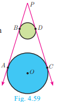

**Thinking Corner**

1. Can we draw two tangents parallel to each other on a circle?
2. Can we draw two tangents perpendicular to each other on a circle?

**Alternate segment**

In the Fig. 4.60, the chord $\mathrm{PQ}$ divides the circle into two segments. The tangent $A B$ is drawn such that it touches the circle at $P$.

The angle in the alternate segment for $\angle Q P B(\angle 1)$ is $\angle Q S P(\angle 1)$ and that for $\angle Q P A(\angle 2)$ is $\angle P T Q(\angle 2)$. Theorem 6 : Alternate Segment theorem

**Statement**

If a line touches a circle and from the point of contact a chord is drawn, the angles between the tangent and the chord are respectively equal to the angles in the corresponding alternate segments.

**Proof**

Given : A circle with centre at $O$, tangent $A B$ touches the circle at $P$ and $P Q$ is a chord. $S$ and $T$ are two points on the circle in the opposite sides of chord $P Q$.

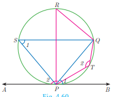

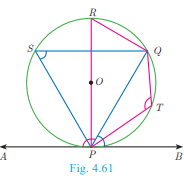

**To prove** $\quad:$ (i) $\angle Q P B=\angle P S Q$ and (ii) $\angle Q P A=\angle P T Q$

**Construction:** Draw the diameter POR. Draw $Q R, Q S$ and $P S$.

| No. | Statement | Reason |
| :---: | :---: | :---: |
| 1. | $\angle R P B=90^{\circ}$   Now, $\angle R P Q+\angle Q P B=90^{\circ}$ | Diameter RP is perpendicular to tangent $A B$. |
| 2. | In $\triangle R P Q, \angle P Q R=90^{\circ}$ | Angle in a semicircle is $90^{\circ}$. |
| 3. | $\angle Q R P+\angle R P Q=90^{\circ}$ | In a right angled triangle, sum of the two   acute angles is $90^{\circ}$. |
| 4. | $\angle R P Q+\angle Q P B=\angle Q R P+\angle R P Q$   $\angle Q P B=\angle Q R P$ | From (1) and (3). |
| 5. | $\angle Q R P=\angle P S Q$ | Angles in the same segment are equal. |
| 6. | $\angle Q P B=\angle P S Q$ | From (4) and (5); Hence (i) is proved. |
| 7. | $\angle Q P B+\angle Q P A=180^{\circ}$ | Linear pair of angles. |
| 8. | $\angle P S Q+\angle P T Q=180^{\circ}$ | Sum of opposite angles of a cyclic   quadrilateral is $180^{\circ}$. |
| 9. | $\angle Q P B+\angle Q P A=\angle P S Q+\angle P T Q$ | From (7) and (8). |
| 10 | $\angle Q P B+\angle Q P A=\angle Q P B+\angle P T Q$ | $\angle Q P B=\angle P S Q$ from $(6)$ |
| 11. | $\angle Q P A=\angle P T Q$ | Hence (ii) is proved.   This completes the proof. |

**Example 4.24** Find the length of the tangent drawn from a point whose distance from the centre of a circle is $5 \mathrm{~cm}$ and radius of the circle is $3 \mathrm{~cm}$.

**Solution** Given OP $=5 \mathrm{~cm}$, radius $r=3 \mathrm{~cm}$

To find the length of tangent $P T$.

In right angled $\triangle O T P$,

$O P^{2}=O T^{2}+P T^{2}$ (by Pythagoras theorem)

$5^{2}=3^{2}+P T^{2}$ gives $P T^{2}=25-9=16$

Length of the tangent $P T=4 \mathrm{~cm}$

**Example 4.25** PQ is a chord of length $8 \mathrm{~cm}$ to a circle of radius $5 \mathrm{~cm}$. The tangents at $\mathrm{P}$ and $\mathrm{Q}$ intersect at a point T. Find the length of the tangent TP.

**Solution** Let $T R=y$. Since, OT is perpendicular bisector of PQ.

$$
P R=Q R=4 \mathrm{~cm}
$$

In $\triangle O R P, O P^{2}=O R^{2}+P R^{2}$

$$
\begin{aligned}
& O R^{2}=O P^{2}-P R^{2} \\
& O R^{2}=5^{2}-4^{2}=25-16= \\
& O T=O R+R T=3+y
\end{aligned}
$$

$$
O R^{2}=5^{2}-4^{2}=25-16=9 \Rightarrow O R=3 \mathrm{~cm}
$$

In $\triangle P R T, T P^{2}=T R^{2}+P R^{2}$

and $\triangle O P T$ we have, $O T^{2}=T P^{2}+O P^{2}$

$$
\begin{aligned}
& O T^{2}=\left(T R^{2}+P R^{2}\right)+O P^{2} \quad\left(\text { substitute for } T P^{2} \text { from }(2)\right) \\
&(3+y)^{2}=y^{2}+4^{2}+5^{2} \quad(\text { substitute for } O T \text { from }(1)) \\
& 9+6 y+y^{2}=y^{2}+16+25 \\
& 6 y=41-9 \text { we get } y=\frac{16}{3}
\end{aligned}
$$

From (2), $T P^{2}=T R^{2}+P R^{2}$

$$
T P^{2}=\left(\frac{16}{3}\right)^{2}+4^{2}=\frac{256}{9}+16=\frac{400}{9} \text { so, } T P=\frac{20}{3} \mathrm{~cm}
$$

**Example 4.26** In Fig.4.64, $O$ is the centre of a circle. $P Q$ is a chord and the tangent $P R$ at $P$ makes an angle of $50^{\circ}$ with $P Q$. Find $\angle P O Q$.

**Solution** $\angle O P Q=90^{\circ}-50^{\circ}=40^{\circ}$ (angle between the radius and tangent is $90^{\circ}$ )

$$
\begin{gathered}
O P=O Q \quad(\text { Radii of a circle are equal }) \\
\angle O P Q=\angle O Q P=40^{\circ} \quad(\triangle O P Q \text { is isosceles }) \\
\angle P O Q=180^{\circ}-\angle O P Q-\angle O Q P \\
\angle P O Q=180^{\circ}-40^{\circ}-40^{\circ}=100^{\circ}
\end{gathered}
$$

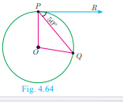

Example 4.27 In Fig.4.65, $\triangle A B C$ is circumscribing a circle. Find the length of $B C$.

Solution $A N=A M=3 \mathrm{~cm}$ (Tangents drawn from same external point are equal)

$$
\begin{aligned}
& B N=B L=4 \mathrm{~cm} \\
& C L=C M=A C-A M=9-3=6 \mathrm{~cm}
\end{aligned}
$$

Gives $B C=B L+C L=4+6=10 \mathrm{~cm}$

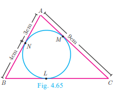

**Example 4.28** If radii of two concentric circles are $4 \mathrm{~cm}$ and $5 \mathrm{~cm}$ then find the length of the chord of one circle which is a tangent to the other circle.

**Solution**

$O A=4 \mathrm{~cm}, \mathrm{OB}=5 \mathrm{~cm}$; also $O A \perp B C$.

$$
\begin{aligned}
O B^{2} & =O A^{2}+A B^{2} \\
5^{2} & =4^{2}+A B^{2} \text { gives } A B^{2}=9
\end{aligned}
$$

Therefore $A B=3 \mathrm{~cm}$

$$
B C=2 \mathrm{AB} \text { hence } B C=2 \times 3=6 \mathrm{~cm}
$$
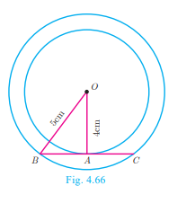

### Construction

**Construction of tangents to a circle**

Now let us discuss how to draw

1. a tangent to a circle using its centre
2. a tangent to a circle using alternate segment theorem
3. pair of tangents from an external point

**Construction of a tangent to a circle (Using the centre)**

**Example 4.29** Draw a circle of radius $3 \mathrm{~cm}$. Take a point $P$ on this circle and draw a tangent at $P$.

**Solution** Given, radius $r=3 \mathrm{~cm}$

**Construction**

Step 1: Draw a circle with centre at $O$ of radius $3 \mathrm{~cm}$.

Step 2: Take a point $P$ on the circle. Join $O P$.

Step 3: Draw perpendicular line to $O P$ which passes through $P$.

Step 4: $T T^{\prime}$ is the required tangent.

**Construct of a tangent to a circle (Using alternate segment theorem)**

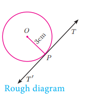
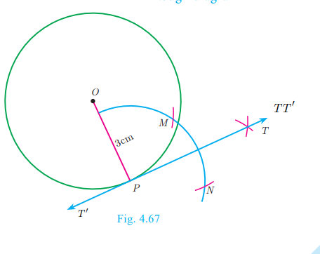

**Example 4.30** Draw a circle of radius $4 \mathrm{~cm}$. At a point $L$ on it draw a tangent to the circle using the alternate segment.

**Solution**

Given, radius $=4 \mathrm{~cm}$

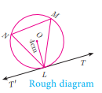

**Construction**

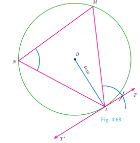

Step 1: With $O$ as the centre, draw a circle of radius $4 \mathrm{~cm}$.

Step 2: Take a point $L$ on the circle. Through $L$ draw any chord $L M$.

Step 3: Take a point $N$ distinct from $L$ and $M$ on the circle, so that $L$, $M$ and $N$ are in anti-clockwise direction. Join $L N$ and $N M$.

Step 4: Through $L$ draw a tangent $T T^{\prime}$ such that $\angle T L M=\angle M N L$.

Step 5: $T T^{\prime}$ is the required tangent.

**Construction of pair of tangents to a circle from an external point $P$.**

**Example 4.31** Draw a circle of diameter $6 \mathrm{~cm}$ from a point $P$, which is $8 \mathrm{~cm}$ away from its centre. Draw the two tangents $P A$ and $P B$ to the circle and measure their lengths.

**Solution** Given, diameter $(d)=6 \mathrm{~cm}$, we find radius $(r)=\frac{6}{2}=3 \mathrm{~cm}$

**Construction**

Step 1: With centre at $O$, draw a circle of radius $3 \mathrm{~cm}$.

Step 2: Draw a line $O P$ of length $8 \mathrm{~cm}$.

Step 3: Draw a perpendicular bisector of $O P$, which cuts $O P$ at $M$.

Step 4: With $M$ as centre and $M O$ as radius, draw a circle which cuts previous circle at $A$ and $B$.

Step5: Join $A P$ and $B P$. $A P$ and $B P$ are the required tangents. Thus length of the tangents are $P A=P B=7.4 \mathrm{~cm}$.

Verification : In the right angle triangle $O A P, P A^{2}=O P^{2}-O A^{2}=8^{2}-3^{2}=64-9=55$

$$
P A=\sqrt{55}=7.4 \mathrm{~cm} \text { (approximately). }
$$
