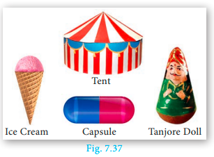
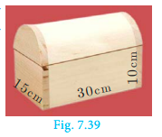
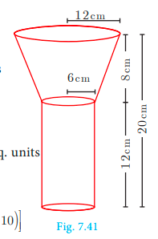
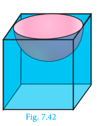
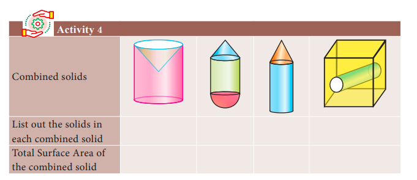
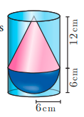
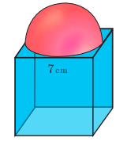

# Volume and Surface Area of Combined Solids

Observe the shapes given (Fig.7.37).

The shapes provided lead to the following definitions of ‘Combined Solid’.

---

A combined solid is said to be a solid 
<!--  -->

formed by combining two or more solids.
The concept of combined solids is 
useful in the fields like doll making, building 
construction, carpentry, etc.

To calculate the surface area of the 
combined solid, we should only calculate the 
areas that are visible to our eyes. For example, if 
a cone is surmounted by a hemisphere, we need 
to just find out the C.S.A. of the hemisphere and C.S.A. of the cone separately and add 
them together. Note that we are leaving the base area of both the cone and the hemisphere 
since both the bases are attached together and are not visible.
But, the volume of the solid formed by joining two basic solids will be the sum of the 
volumes of the individual solids.

**Example 7.24**  A toy is in the shape of a cylinder surmounted by a 
<!--  -->

hemisphere. The height of the toy is 25 cm. Find the total surface 
area of the toy if its common diameter is 12 cm.

**Solution**   Let r and h be the radius and height of the cylinder 
respectively.

 Given that, diameter d = 12 cm, radius r = 6 cm

Total height of the toy is 25 cm

Therefore, height of the cylindrical portion = − 25 6 = 19 cm

 T.S.A. of the toy =C.S.A. of the cylinder + C.S.A. of the hemisphere
 +Base Area of the cylinder

 = 2&#960;rh + 2&#960;$r^{2}$ + &#960;$r^{2}$

 = &#960;rh (2h+ 3r) sq.units

 = 22/7 x 6 x (38 + 18)
 
 =22/7 x 6 x 56 = 1056

Therefore, T.S.A. of the toy is 1056 $cm^{2}$

**Example 7.25**  A jewel box (Fig. 7.39) is in the shape of a cuboid of 
<!--  -->

dimensions 30 cm x 15 cm x 10 cm surmounted by a half part of 
a cylinder as shown in the figure. Find the volume of the box.

**Solution**  Let l, b and h1 be the length, breadth and height of the 
cuboid. Also let us take r and h2 be the radius and height of the 
cylinder.

---

 Now, Volume of the box = Volume of the cuboid + 1/2
(Volume of cylinder)

 = (l x b x h1) + 1/2(&#960;$r^{2}$ h2) cu. units
 =(30 x 15 x 10)+ 1/2(22/7 x 15/2 x 15/2 x 30)
 = 4500 + 2651.79 = 7151.79

Therefore, Volume of the box = 7151.79 $cm^{3}$

**Example 7.26**  Arul has to make arrangements for the accommodation of 150 persons 
for his family function. For this purpose, he plans to build a tent which is in the shape of 
cylinder surmounted by a cone. Each person occupies 4 sq. m of the space on ground and 
40 cu. meter of air to breathe. What should be the height of the conical part of the tent if 
the height of cylindrical part is 8 m?

**Solution**  Let h1 and h2 be the height of cylinder and cone respectively. 

 Area for one person = 4 sq. m

 Total number of persons =150 

 Therefore, total base area =150 x 4

 &#960;$r^{2}$ = 600 ... (1)

Volume of air required for 1 person = 40 $m^{3}$

Total Volume of air required for 150 persons= 150 x 40 = 6000 $m^{3}$

 &#960;$r^{2}$ h1 + 1/3&#960;$r^{2}$ h2= 6000

 &#960;$r^{2}$ (h1 +1/3h2)= 6000

 600(8 +1/3h2) = 6000 [using (1)]

 8 + 1/3 h2 = 6000 /600

 1/3 h2 = 10 – 8 = 2

 h2 = 6 m

Therefore, the height of the conical tent h2 is 6 m

**Example 7.27** A funnel consists of a frustum of a cone attached to a cylindrical portion 
12 cm long attached at the bottom. If the total height be 20 cm, diameter of the cylindrical 
portion be 12 cm and the diameter of the top of the funnel be 24 cm. Find the outer 
surface area of the funnel.

---

**Solution**  Let R, r be the top and bottom radii of the frustum.

Let h1
, h2 be the heights of the frustum and cylinder respectively.

Given that, R = 12 cm, r = 6 cm, h2 = 12 cm

Now, h1 = 20–12 = 8 cm

Here, Slant height of the frustum l = $ \sqrt{(R-r)^{2}+h1^{2}}$ units
 = $ \sqrt{36+64}$

 l = 10 cm

 Outer surface area = 2&#960;rh2 + &#960;(R+ r) l sq. units
              
 = &#960;[2rh2 + (R + r) l ]

 = &#960;[(2 x 6 x 12) + (18 x 10)]
 
 =&#960;[144 + 180]
 
 =22/7 x 324 = 1018.28

Therefore, outer surface area of the funnel is 1018.28 $cm^{2}$

**Example 7.28**  A hemispherical section is cut out from one face of 
a cubical block (Fig.7.42) such that the diameter l of the hemisphere 
is equal to side length of the cube. Determine the surface area of 
the remaining solid.

**Solution**  Let r be the radius of the hemisphere.

Given that, diameter of the hemisphere = side of the cube = l

Radius of the hemisphere = l/2

 TSA of the remaining solid = Surface area of the cubical part + C.S.A. of the hemispherical part 
 − Area of the base of the hemispherical part

 = 6 x $(Edge)^{2}$ + 2&#960;$r^{2}$ - &#960;$r^{2}$
 = 6 x $(Edge)^{2}$ + &#960;$r^{2}$ 
 
 = 6 x $(l)^{2}$ + &#960;$(l/2)^{2}$ = 1/4 (24 + &#960;)$l^{2}$

 Total surface area of the remaining solid = 1/4 (24 + &#960;)$l^{2}$ sq. units

 ---

 **Exercise 7.3**

1. A vessel is in the form of a hemispherical bowl mounted by a hollow cylinder. The 
diameter is 14 cm and the height of the vessel is 13 cm. Find the capacity of the vessel.
2. Nathan, an engineering student was asked to make a model shaped like a cylinder 
with two cones attached at its two ends. The diameter of the model is 3 cm and its 
length is 12 cm. If each cone has a height of 2 cm, find the volume of the model that 
Nathan made.
3. From a solid cylinder whose height is 2.4 cm and the diameter 1.4 cm, a cone of the 
same height and same diameter is carved out. Find the volume of the remaining 
solid to the nearest cm3 .
4. A solid consisting of a right circular cone of height 12 cm and radius 
6 cm standing on a hemisphere of radius 6 cm is placed upright in a 
right circular cylinder full of water such that it touches the bottom. 
Find the volume of the water displaced out of the cylinder, if the 
radius of the cylinder is 6 cm and height is 18 cm.
5. A capsule is in the shape of a cylinder with two hemisphere stuck to 
each of its ends. If the length of the entire capsule is 12 mm and the diameter of the 
capsule is 3 mm, how much medicine it can hold?
6. As shown in figure a cubical block of side 7 cm is surmounted 
by a hemisphere. Find the surface area of the solid.
7. A right circular cylinder just enclose a sphere of radius r units. 
Calculate 
1. the surface area of the sphere 
2. the curved surface area of the cylinder 
3. the ratio of the areas obtained in 1 and 2

---

