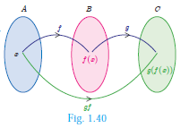
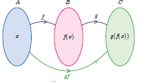
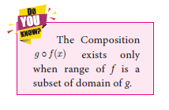



# Composition of Functions 

When a car driver depresses the accelerator pedal, it controls the flow of fuel which in turn influences the speed of the car. Likewise, the composition of two functions is a kind of 'chain reaction', where the functions act upon one after another (Fig.1.40).

We can explain this further with the concept that a function is a 'process'. If $f$ and $g$ are two functions then the composition $g(f(x))$ (Fig.1.41) is formed in two steps.
 
(i) Feed an input ( say $x$ ) to $f$;

(ii) Feed the output $f(x)$ to $g$ to get $g(f(x))$ and call it $g f(x)$.

Illustration

Consider the set $A$ of all students, who appeared in class $X$ of Board Examination. Each student appearing in the Board Examination is assigned a roll number. In order to have confidentiality, the Board arranges to deface the roll number of each student and assigns a code number to each roll number.

 
 Let $A$ be the set of all students appearing for the board exam. $B \subseteq \mathbb{N}$ be the set all roll numbers and $C \subseteq \mathbb{N}$ be the set of all code numbers (Fig.1.41). This gives rise to two functions $f: A \rightarrow B$ and $g: B \rightarrow C$ given by $b=f(a)$ be the roll number assigned to student $a, c=g(b)$ be the code number assigned to roll number $b$, where $a \in A, b \in B$ and $c \in C$.

We can write $c=g(b)=g(f(a))$.

Thus, by the combination of these two functions, each student is eventually attached a code number. This idea leads to the following definition.

>Definition
>Let $f: A \rightarrow B$ and $g: B \rightarrow C$ be two functions (Fig.1.42). Then the composition of $f$ and $g$ denoted by $g \circ f$ is defined as the function $g \circ f(x)=g(f(x))$ $\forall x \in A$.

Example 1.19 Find $f \circ g$ and $g \circ f$ when $f(x)=2 x+1$ and $g(x)=x^{2}-2$
 
Fig. 1.42

f (x) = 2x +1 , g(x) = x2 – 2
f  g(x) = f (g(x)) = f (x2 −2) = 2(x2 −2)+1 = 2x2 −3
g  f (x) = g(f (x)) = g(2x +1) = (2x +1)2 −2 = 4x2 + 4x −1
Thus f  g = 2x2 −3, g  f = 4x2 + 4x −1. From the above, we see that f  g ¹ g  f . 

>Note
>Generally, $f \circ g \neq g \circ f$ for any two functions $f$ and $g$. So, composition of functions is not commutative.

Example 1.20 Represent the function $f(x)=\sqrt{2 x^{2}-5 x+3}$ as a composition of two functions.

Solution $f_{2}(x)=2 x^{2}-5 x+3$ and $f_{1}(x)=\sqrt{x}$

$$
\begin{aligned}
f(x)=\sqrt{2 x^{2}-5 x+3} & =\sqrt{f_{2}(x)} \\
& =f_{1}\left[f_{2}(x)\right] \quad=f_{1} f_{2}(x)
\end{aligned}
$$

Example 1.21 If $f(x)=3 x-2, g(x)=2 x+k$ and if $f \circ g=g \circ f$, then find the value of $k$.

Solution $f(x)=3 x-2, g(x)=2 x+k$

$$
f \circ g(x)=f(g(x))=f(2 x+k)=3(2 x+k)-2=6 x+3 k-2
$$

$f \circ g(x)=6 x+3 k-2$.

$g \circ f(x)=g(3 x-2)=2(3 x-2)+k$

$g \circ f(x)=6 x-4+k$.

Given that $f \circ g=g \circ f$

$$
\begin{aligned}
\therefore 6 x+3 k-2 & =6 x-4+k \\
6 x-6 x+3 k-k & =-4+2 \Rightarrow k=-1
\end{aligned}
$$
 

Example 1.22 Find $k$ if $f \circ f(k)=5$ where $f(k)=2 k-1$.

Solution $f \circ f(k)=f(f(k))$

$$
\begin{aligned}
& =2(2 k-1)-1=4 k-3 . \\
f \circ f(k) & =4 k-3
\end{aligned}
$$

But, $f \circ f(k)=5$

$$
\therefore 4 k-3=5 \Rightarrow k=2 \text {. }
$$

## Composition of three functions

Let $A, B, C, D$ be four sets and let $f: A \rightarrow B, g: B \rightarrow C$ and $h: C \rightarrow D$ be three functions (Fig.1.43). Using composite functions $f \circ g$ and $g \circ h$, we get two new functions like $(f \circ g) \circ h$ and $f \circ(g \circ h)$.
 
We observed that the composition of functions is not commutative. The natural question is about the associativity of the operation.

> Note
>Composition of three functions is always associative. That is, $f \circ(g \circ h)=(f \circ g) \circ h$

Example 1.23 If $f(x)=2 x+3, g(x)=1-2 x$ and $h(x)=3 x$. Prove that $f \circ(g \circ h)=(f \circ g) \circ h$

Solution $f(x)=2 x+3, g(x)=1-2 x, h(x)=3 x$

$$
\text { Now, }(f \circ g)(x)=f(g(x))=f(1-2 x)=2(1-2 x)+3=5-4 x
$$

Then, $(f \circ g) \circ h(x)=(f \circ g)(h(x))=(f \circ g)(3 x)=5-4(3 x)=5-12 x$

$$
\begin{aligned}
(g \circ h)(x) & =g(h(x))=g(3 x)=1-2(3 x)=1-6 x \\
\Rightarrow f \circ(g \circ h)(x) & =f(1-6 x)=2(1-6 x)+3=5-12 x
\end{aligned}
$$

From (1) and (2), we get $(f \circ g) \circ h=f \circ(g \circ h)$

Example 1.24 Find $x$ if $g f f(x)=f g g(x)$, given $f(x)=3 x+1$ and $g(x)=x+3$.

Solution

$$
\begin{aligned}
g f f(x) & =g[f\{f(x)\}](\text { This means " } g \text { of } f \text { of } f \text { of } x \text { ") } \\
& =g[f(3 x+1)]=g[3(3 x+1)+1]=g(9 x+4) \\
g(9 x+4) & =[(9 x+4)+3]=9 x+7 \\
f g g(x) & =f[g\{g(x)\}](\text { This means " } f \text { of } g \text { of } g \text { of } x \text { ") } \\
& =f[g(x+3)]=f[(x+3)+3]=f(x+6) \\
f(x+6) & =[3(x+6)+1]=3 x+19
\end{aligned}
$$

These two quantities being equal, we get $9 x+7=3 x+19$. Solving this equation we obtain $x=2$. 

>Progress Check
>State your answer for the following questions by selecting the correct option.
>1. Composition of functions is commutative
(a) Always true
(b) Never true
(c) Sometimes true
>2. Composition of functions is associative
(a) Always true
(b) Never true
(c) Sometimes true 

Activity 4

Given that $h(x)=f \circ g(x)$, fill in the table for $h(x)$

| $x$ | $f(x)$ |
| :---: | :---: |
| 1 | 2 |
| 2 | 3 |
| 3 | 1 |
| 4 | 4 |

| $x$ | $g(x)$ |
| :---: | :---: |
| 1 | 2 |
| 2 | 4 |
| 3 | 3 |
| 4 | 1 |

| $x$ | $h(x)$ |
| :---: | :---: |
| 1 | 3 |
| 2 | - |
| 3 | - |
| 4 | - |

How to find $h(1)$ ?
$$
\begin{aligned}
h(x) & =f \circ g(x) \\
h(1) & =f \circ g(1) \\
& =f(2)=3 \\
\therefore h(1) & =3
\end{aligned}
$$ 

