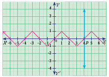
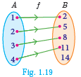
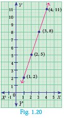



# Representation of Functions 

A function may be represented by
(a) a set of ordered pairs
(b) a table form
(c) an arrow diagram
(d) a graphical form

Let $f: A \rightarrow B$ be a function

(a) Set of ordered pairs

The set $f=\{(x, y) \mid y=f(x), x \in A\}$ of all ordered pairs represent a function.

(b) Table form

The values of $x$ and the values of their respective images under $f$ can be given in the form of a table.

(c) Arrow diagram

An arrow diagram indicates the elements of the domain of $f$ and their respective images by means of arrows.

(d) Graph

The ordered pairs in the collection $f=\{(x, y) \mid y=f(x), x \in A\}$ are plotted as points in the $X Y$-plane. The graph of $f$ is the totality of all such points.

Every function can be represented by a curve in a graph. But not every curve drawn in a graph will represent a function.

The following test will help us in determining whether a given curve is a function or not.

## Vertical line test

A curve drawn in a graph represents a function, if every vertical line intersects the curve in at most one point.

Example 1.10 Using vertical line test, determine which of the following curves (Fig.1.18(a), 1.18(b), 1.18(c), 1.18(d)) represent a function?

Solution :  The curves in Fig.1.18 (a) and Fig.1.18 (c) do not represent a function as the vertical lines meet the curves in two points $P$ and $Q$.

The curves in Fig. 1.18 (b) and Fig. 1.18 (d) represent a function as the vertical lines meet the curve in at most one point.

> Note: 
> Any equation represented in a graph is usually called a curve.

Fig. 1.18(d)

Example 1.11 Let $A=\{1,2,3,4\}$ and $B=\{2,5,8,11,14\}$ be two sets. Let $f: A \rightarrow B$ be a function given by $f(x)=3 x-1$. Represent this function
(i) by arrow diagram
(ii) in a table form
(iii) as a set of ordered pairs
(iv) in a graphical form

Solution 

$$
\begin{aligned}
& A=\{1,2,3,4\} ; B=\{2,5,8,11,14\} ; f(x)=3 x-1 \\
& f(1)=3(1)-1=3-1=2 ; \quad f(2)=3(2)-1=6-1=5 \\
& f(3)=3(3)-1=9-1=8 ; \quad f(4)=4(3)-1=12-1=11
\end{aligned}
$$

(i) Arrow diagram

Let us represent the function $f: A \rightarrow B$ by an arrow diagram (Fig.1.19).

(ii) Table form

The given function $f$ can be represented in a tabular form as given below

| $x$ | 1 | 2 | 3 | 4 |
| :---: | :---: | :---: | :---: | :---: |
| $f(x)$ | 2 | 5 | 8 | 11 |

(iii) Set of ordered pairs

The function $f$ can be represented as a set of ordered pairs as

$f=\{(1,2),(2,5),(3,8),(4,11)\}$

 (iv) Graphical form

In the adjacent $X Y$-plane the points

$(1,2),(2,5),(3,8),(4,11)$ are plotted (Fig.1.20).

